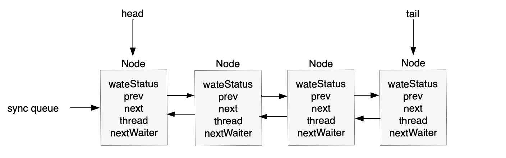
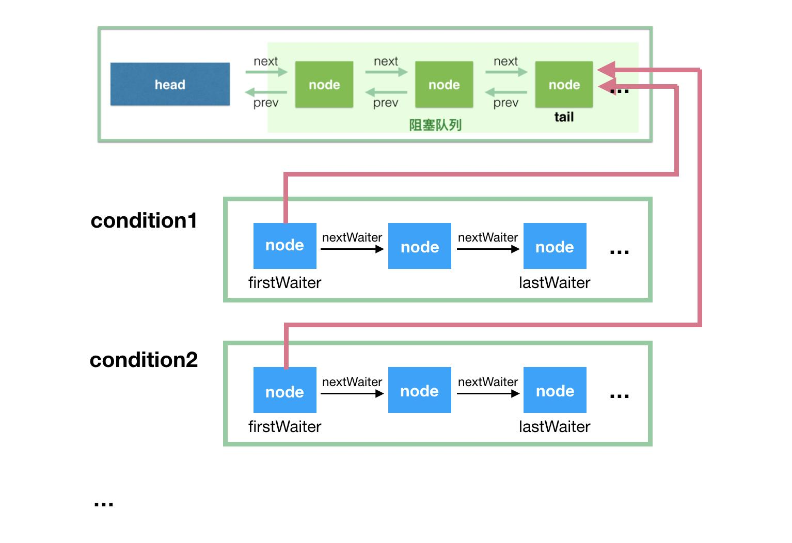
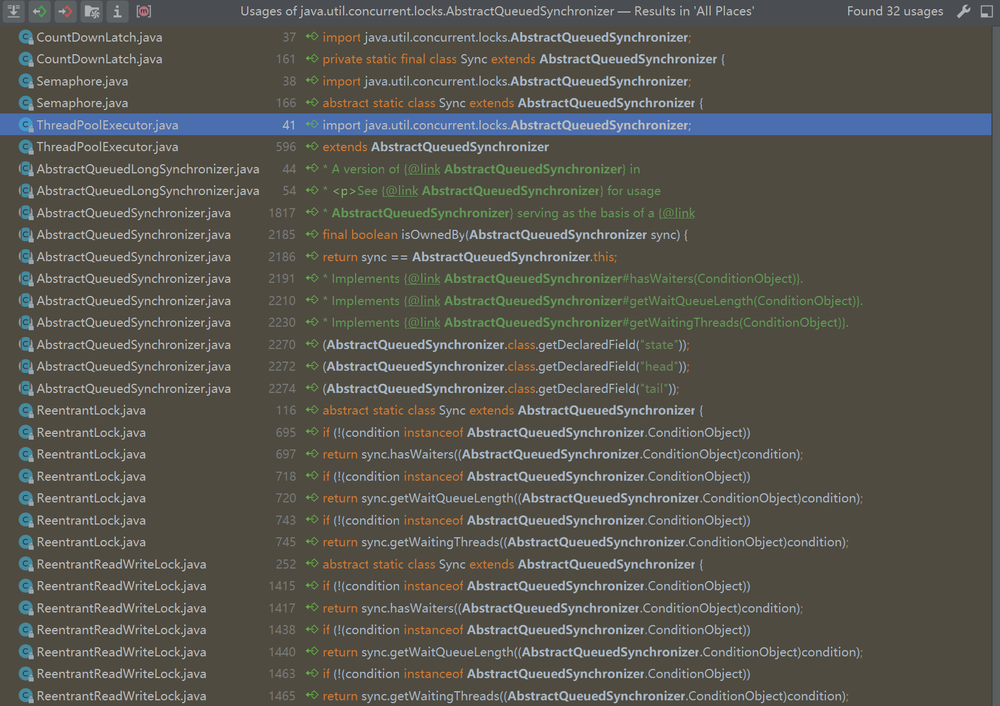

# AQS

java并发包里的AQS同步管理框架，是一个基于等待队列（其中的队列节点是线程）和持有锁的状态（不仅有状态还有持有锁线程的个数）的抽象的通用的框架，JUC并发工具基本都是基于它，例如CountDownLatch。

## AQS的队列

AQS的等待队列是是“CLH”（Craig、Landin和Hagersten）锁队列的变体。它是一个双向链表。有如下基本组成

- ```java
  volatile int waitStatus
  枚举：
      CANCELLED=1 : 表明线程已被取消
      SIGNAL=-1 : 表明后继节点的线程需要被唤醒
      CONDITION=-2 ：与Condition相关，该标识的结点处于等待队列中，结点的线程等待在Condition上，当其他线程调用了Condition的signal()方法后，CONDITION状态的结点将从等待队列转移到同步队列中，等待获取同步锁
      PROPAGATE=-3 ：与共享模式相关，在共享模式中，该状态标识结点的线程处于可运行状态。
  注：The field is initialized to 0 for normal sync nodes, and CONDITION for condition nodes. It is modified using CAS (or when possible, unconditional volatile writes).
  ```

- ```java
  volatile Node prev
  前驱节点
  ```

- ```java
  volatile Node next
  后驱节点
  ```

- ```java
  volatile Node nextWaiter
  链接到下一个等待条件的节点，或共享的特殊值。因为只有在独占模式下保持时才访问条件队列，所以我们只需要一个简单的链接队列来保持节点在等待条件时的状态。然后将它们转移到队列中以重新获取。由于条件只能是独占的，我们通过使用特殊值来表示共享模式来保存字段。
  注：在AQS中支持两种列表，阻塞队列和条件队列。阻塞队列使用双向链表，条件队列使用单向链表。两种数据结构是并行存在的。
  ```

- ```java
  volatile Thread thread
  The thread that enqueued this node. Initialized on construction and nulled out after use
  ```

  

### 阻塞队列的构造图



### 条件队列和阻塞队列的关系图




## AQS的同步状态

AQS的同步状态是使用了一个int变量进行的存储。这使得AQS不仅可以满足独占，也可以支持共享。int的低位可以用来存储共享锁的线程的个数。

```java
private volatile int state;
```

AQS中已经封装了java底层的CAS方法去原子操作该状态变量了

```java
protected final boolean compareAndSetState(int expect, int update) {
    // See below for intrinsics setup to support this
    return unsafe.compareAndSwapInt(this, stateOffset, expect, update);
}
```


## AQS的核心方法

- ```java
  protected boolean tryAcquire(int arg)
      尝试获取锁；由子类具体实现
  ```

- ```java
  protected boolean tryRelease(int arg)
      尝试释放锁；由子类具体实现
  ```

- ```java
  public final void acquire(int arg) 
      获取锁；AQS统一实现，子类只能调用，不能重写。
  ```

- ```java
  public final boolean release(int arg)
      释放锁；AQS统一实现，子类只能调用，不能重写。
  ```


上述四个方法都是独占模式下的方法，对应的，也都有共享模式下的方法。

tryAcquire是尝试获取锁，里面会去尝试修改上述的锁变量state。如下

```java
final boolean nonfairTryAcquire(int acquires) {
    final Thread current = Thread.currentThread();
    int c = getState();
    if (c == 0) {
        if (compareAndSetState(0, acquires)) {
            setExclusiveOwnerThread(current);
            return true;
        }
    }
    else if (current == getExclusiveOwnerThread()) {
        int nextc = c + acquires;
        if (nextc < 0) // overflow
            throw new Error("Maximum lock count exceeded");
        setState(nextc);
        return true;
    }
    return false;
}
```

acquire则是封装了在获取不到锁时进行的入队操作。这个操作和你要使用什么样的锁没有什么关系，所以统一由父类实现。如下。

```java
public final void acquire(int arg) {
    if (!tryAcquire(arg) &&
        acquireQueued(addWaiter(Node.EXCLUSIVE), arg))
        selfInterrupt();
}
```

入队的时候会去判断当前入队的节点node(封装了当前线程)处于队列的什么位置，从而进行不同的操作。如果不是头节点后尝试获取锁的那个节点，则就进行挂起。然后会在后续release方法中被重新唤醒。

```java
private static boolean shouldParkAfterFailedAcquire(Node pred, Node node) {
    int ws = pred.waitStatus;
    if (ws == Node.SIGNAL)
        /*
         * This node has already set status asking a release
         * to signal it, so it can safely park.
         */
        return true;
    if (ws > 0) {
        /*
         * Predecessor was cancelled. Skip over predecessors and
         * indicate retry.
         */
        do {
            node.prev = pred = pred.prev;
        } while (pred.waitStatus > 0);
        pred.next = node;
    } else {
        /*
         * waitStatus must be 0 or PROPAGATE.  Indicate that we
         * need a signal, but don't park yet.  Caller will need to
         * retry to make sure it cannot acquire before parking.
         */
        compareAndSetWaitStatus(pred, ws, Node.SIGNAL);
    }
    return false;
}

private final boolean parkAndCheckInterrupt() {
        LockSupport.park(this);
        return Thread.interrupted();
    }
```

```java
private void unparkSuccessor(Node node) {
    /*
     * If status is negative (i.e., possibly needing signal) try
     * to clear in anticipation of signalling.  It is OK if this
     * fails or if status is changed by waiting thread.
     */
    int ws = node.waitStatus;
    if (ws < 0)
        compareAndSetWaitStatus(node, ws, 0);

    /*
     * Thread to unpark is held in successor, which is normally
     * just the next node.  But if cancelled or apparently null,
     * traverse backwards from tail to find the actual
     * non-cancelled successor.
     */
    Node s = node.next;
    if (s == null || s.waitStatus > 0) {
        s = null;
        for (Node t = tail; t != null && t != node; t = t.prev)
            if (t.waitStatus <= 0)
                s = t;
    }
    if (s != null)
        LockSupport.unpark(s.thread);
}
```

这两个方法中对线程挂起和唤醒均使用的LockSupport中的方法。

## AQS为什么说是JUC的基础

 


由上图可以看出来，无论是同步工具（CountDownLatch,Semaphore）还是执行器（ThreadPoolExecutor）,又或者是显示锁（Lock.ReentrantLock）。其中内置的关键Sync都是AQS的子类具体实现的一种。